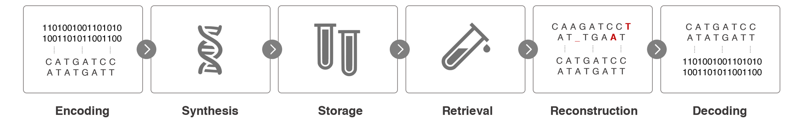

# Single Read Reconstruction for DNA Data Storage Using Transformers

## Overview
This repository is the official implementation of [**"Single Read Reconstruction for DNA Data Storage Using Transformers"**](https://arxiv.org/abs/2109.05478v2), a novel approach leveraging an encoder-decoder Transformer architecture for DNA-based data storage. In the face of increasing global data storage demands, DNA storage emerges as a promising solution with high information density. However, DNA synthesis and sequencing are prone to errors. Our model uniquely addresses this by facilitating single-read reconstruction, significantly reducing reading costs and achieving lower error rates compared to traditional multi-read methods.




## Key Features
- **Transformer Architecture**: A groundbreaking deep learning model specifically designed for error correction in DNA sequences.
- **Single-Read Reconstruction**: First-of-its-kind approach using deep learning for single-read reconstruction in DNA-based storage, significantly reducing overall costs.
- **Versatility in Data Types**: Capable of handling and reconstructing diverse data types, including text, images, and code scripts.
- **Efficient and Accurate**: Demonstrates lower error rates in reconstruction from single DNA strand reads than existing state-of-the-art algorithms.

## Installation
Run `pip install -r requirements.txt` to install required packages.

## Usage
- **Configuration**: Customize model configurations in `configuration.py`.
- **Data Processing**: Employ `data_utils` for efficient data loading and preparation.
- **Model Training**: Initiate model training through `DNAmodel.py`.
- **Diverse Data Handling**: Utilize `image_utils.py` and `text_utils.py` for conversion and reconstruction of images and text data.
- **Prediction and Evaluation**: Execute predictions and evaluate performance using `Predict.py`.


## Components
- `configuration.py`: Settings and parameters for the model.
- `data_utils`: Modules for data handling and preprocessing.
- `DNAmodel.py`: Core deep learning model and associated methods.
- `image_utils.py`, `text_utils.py`: Tools for processing image and text data.
- `Predict.py`: Functions for model predictions and evaluations.
- `utils.py`: General utilities, including high-fidelity error simulation methods.

## Requirements
Python packages required are listed in `requirements.txt`.

## Citation
If you find this work useful, please cite our paper:

```
@misc{nahum2021singleread,
      title={Single-Read Reconstruction for DNA Data Storage Using Transformers}, 
      author={Yotam Nahum and Eyal Ben-Tolila and Leon Anavy},
      year={2021},
      eprint={2109.05478},
      archivePrefix={arXiv},
      primaryClass={cs.ET}
}
```

## License
This project is licensed under the MIT License.

For more details, refer to the full paper: [Single-Read Reconstruction for DNA Data Storage Using Transformers](https://arxiv.org/abs/2109.05478v2).
